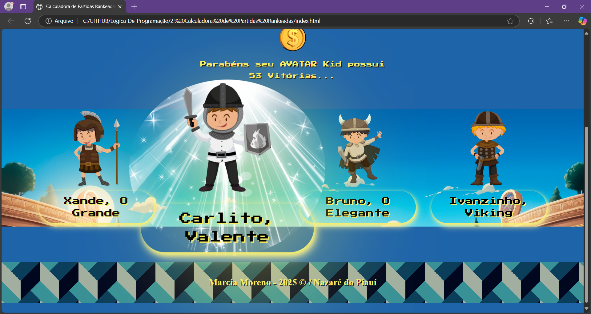

<h1 align="center">Desafio Lógica de Programação - Calculadora de Partidas Rankeadas   <a href="https://dio.me/"> DIO (Digital Inovation One)</a></h1>

> **O Que deve ser utilizado no script...**

- Variáveis
- Operadores
- Laços de repetição
- Estruturas de decisões
- Retorno de Funções
- Funções com parâmetros
  

## Objetivo

Criar uma função que recebe como parâmetro a quantidade de vitórias e derrotas de um jogador, depois disso retornar o resultado para uma variável, o saldo de Rankeadas deve ser feito através do calculo (vitórias - derrotas).

### _Imagem da variável indexada via html..._

     

1. Se vitórias for menor do que 10 = Ferro
2. Se vitórias for entre 11 e 20 = Bronze
3. Se vitórias for entre 21 e 50 = Prata
4. Se vitórias for entre 51 e 80 = Ouro
5. Se vitórias for entre 81 e 90 = Diamante
6. Se vitórias for entre 91 e 100= Lendário
7. Se vitórias for maior ou igual a 101 = Imortal

  

## **_Saída do script finalizado_**... 
 

> Pagina Index.html, 

  

>Momento em que o herói é escolhido... Contudo o usuário precisa ter recolhido a recompensa por participar do toreneio, o mesmo resultado sera equivalente as vitorias conquistados pelo avatar escolhido...

  

>Em seguida o usuario deve escolher o ponente e clicar no botão de disputa... Caso se queira verificar quantas vitorias o oponente detem, basta clicar na imagem do monstrinho respectivo...

  

>Então... Finlizando... De acordo com o numero de vitorias arrecadado no momento do sorteio, esse mesmo é disputado com o nivel e numero de viorias do oponente... Ganhando quem tem mais experiencia de batalha de um para com o outro... No tete-à-tete... 

