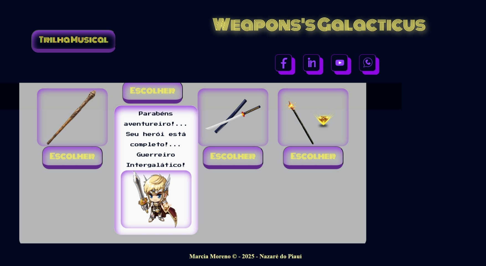
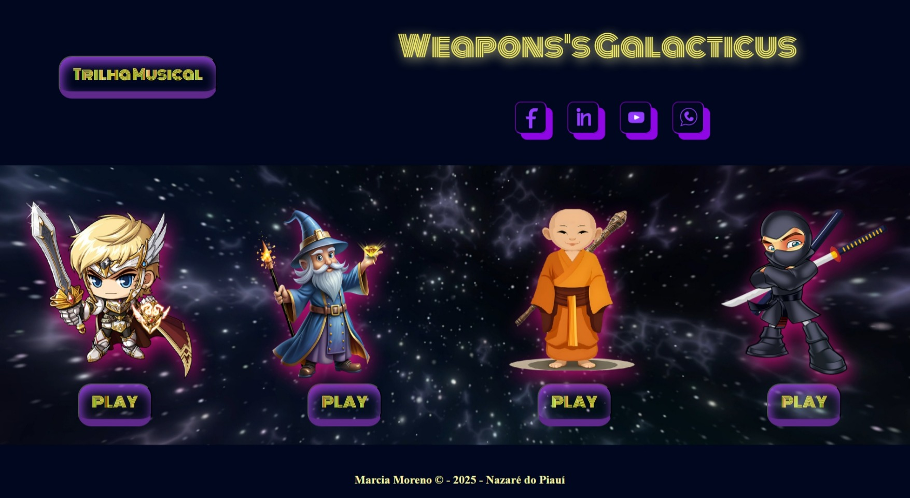
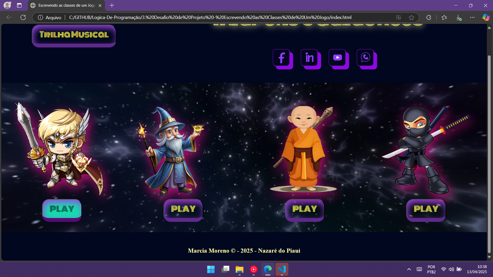
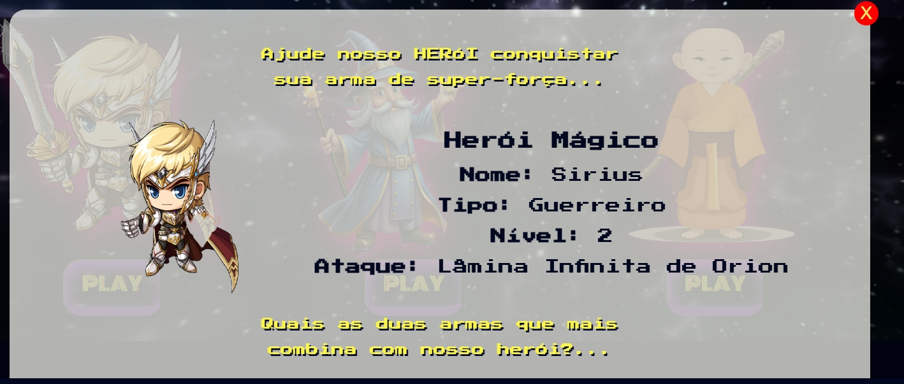
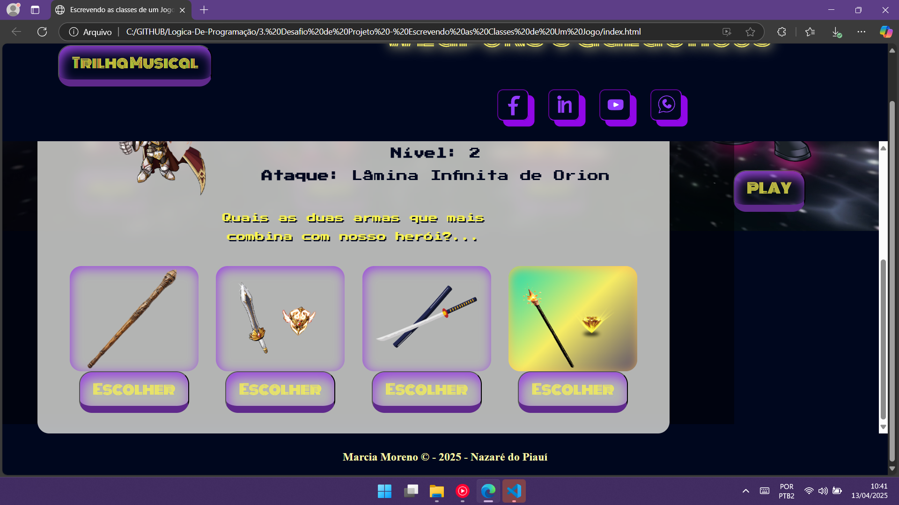

<h1 align="center">Desafio Lógica de Programação - Escrevendo as Classes de um JOGO.  <a href="https://dio.me/"> DIO (Digital Inovation One)</a></h1>

> **O Que deve ser utilizado no script...**

- Variáveis
- Operadores
- Laços de repetição
- Estruturas de decisões
- Retorno de Funções
- Funções com parâmetros
- Classes e Objetos
  

## Objetivo

Criar uma classe generica que represente um herói de uma aventura e que possua as seguintes propriedades:

- nome
- idade
- tipo (ex: guerreiro, mago, monge, ninja )

Além disso, deve ter um método que deve atender os seguientes requisitos:

- exibir a mensagem: "o {tipo} de {ataque}"
- aonde o {tipo} deve ser concatenando o tipo que está na propriedade da classe
- e no {ataque} deve seguir uma descrição diferente conforme o tipo, seguindo a tabela abaixo:

### _Imagem da variável indexada via html..._

     

1. _**se mago ->**_ no ataque exibir ( magia)
2. _**se guerreiro ->**_ no ataque exibir ( espada)
3. _**se monge ->**_ no ataque exibir (usou objetos marciais)
4. _**se ninja ->**_ no ataque exibir (usou shuriken ou itens parecidos de um ninja)

  

## **_Saída do script finalizado_**... 
 

>Na página index.html estão contidos os atalhos para a rede social do autor. Em seguida no cabeçalho da página é possivel ativar uma trilha musical para acompanhar as atividades durante a execução das atividades na página...

  

>Em seguida o usuario deve escolher o herói e clicar no botão PLAY... 

  

>Na próxima tela que se abre é possivel ver os dados como  nome, nivel e tipo de ataque do herói, e rolando o scroll as possiveis armas que faltam para completá-lo... Esta é a missão central da atividade... Verificar quais as armas compativeis conforme o tipo escolhido. 

  

>Então... Finalizando... Temos uma mensagem de confirmação esclarecendo se o nosso herói esta completado e sua imagem confirma isso... 

