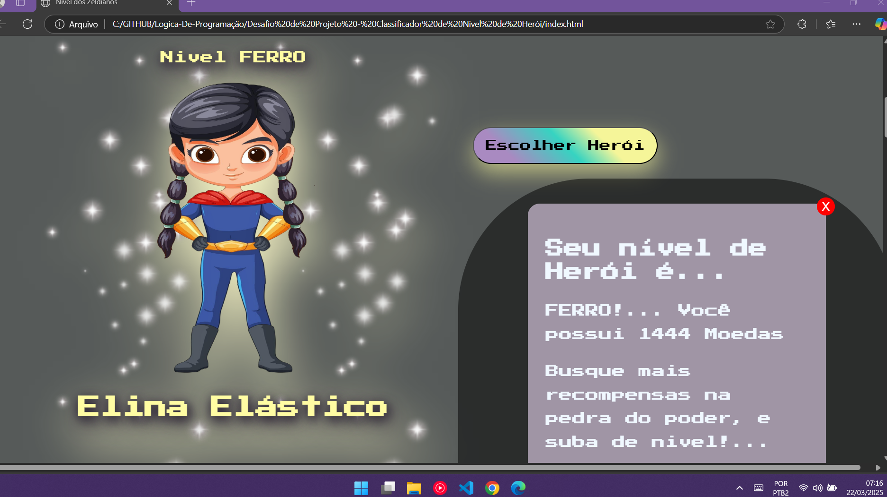
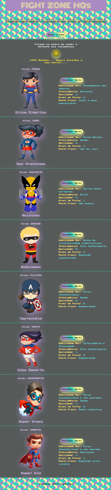

<h1 align="center">Desafio Lógica de Programação - Classificador de Nível de Herói  <a href="https://dio.me/"> DIO (Digital Inovation One)</a></h1>

> **O Que deve ser utilizado no script...**

- Variáveis
- Operadores
- Laços de repetição
- Estruturas de decisões

## Objetivo

Criar uma variável para armazenar o nome e a quantidade de experiência (XP) de um herói, depois utilizar uma estrutura de decisão para apresentar alguma das mensagens abaixo:

### _Imagem da variável indexada via html..._

     

1. Se XP for menor do que 1.000      = Ferro
2. Se XP for entre 1.001 e 2.000     = Bronze
3. Se XP for entre 2.001 e 5.000     = Prata
4. Se XP for entre 5.001 e 7.000     = Ouro
5. Se XP for entre 7.001 e 8.000     = Platina
6. Se XP for entre 8.001 e 9.000     = Ascendente
7. Se XP for entre 9.001 e 10.000    = Imortal
8. Se XP for maior ou igual a 10.001 = Radiante

## Saída

### _Imagem da saída do Aluno..._

     

Ao final deve se exibir uma mensagem:
"O Herói de nome **{nome}** está no nível de **{nivel}**"

>**Observação do Aluno:**
Para concluir o projeto, utilizei meu pré-conhecimento em **HTML e CSS**, e confesso que é a primeira vez que tento moldar uma ideia incluindo o java script... E amei a experência... Entendo que o código deve possuir muitas melhorias, devido as quase infinitas repetições... Mas para a minha primeiro experiência, confesso que me senti recompensada depois de tanto esforço, tentando encaixar o que não conhecia... Mas quando o bonito 'roda'(run)... Não tem quem explique a sensação de felicidade!... 
Bora ver como eu deixei esse 'coisa no ponto'... 

  

> #HOME DO PROJETO FINALIZADO...

     

