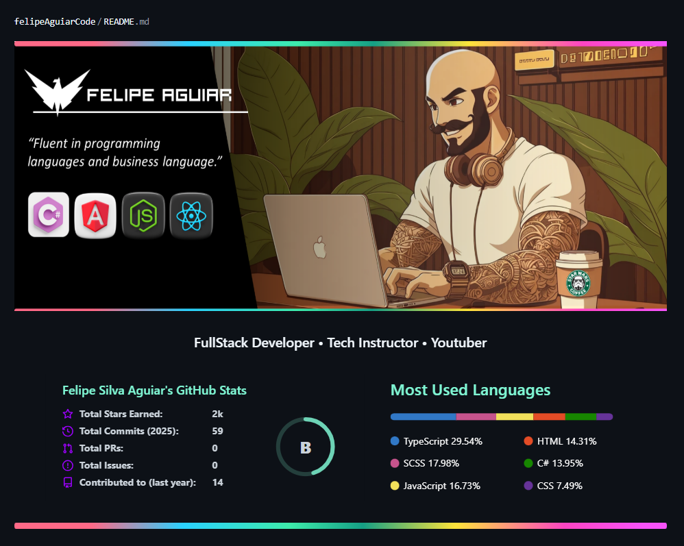

# LÓGICA DE PROGRAMAÇÃO - DIO [(Digital Inovation One)](https://dio.me/)

Professor Orientador: Felipe Silva.

| Perfil GIT/GitHobby | Dados Profissionais. |
|---------------------------------------------|----------------------------------------| 
| |  |

